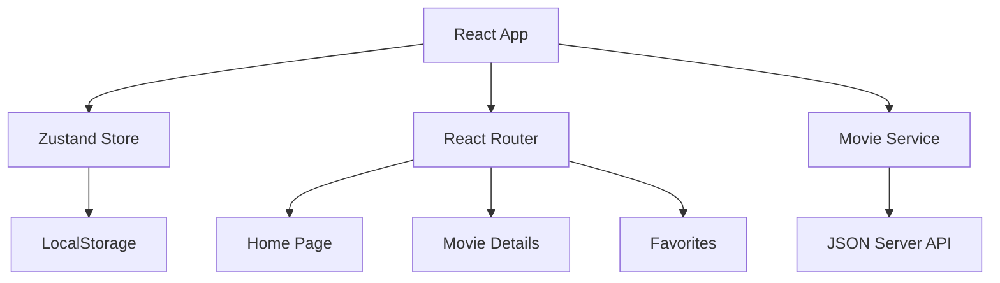

# react-movie-explorer

[](https://github.com/username/2019-react-movie-explorer/actions)
[](https://opensource.org/licenses/MIT)

A modern movie search and favorites application built with React, TypeScript, and Vite. Search for movies, view detailed information, and maintain a personal favorites collection.

## Architecture



## Features

- **Movie Search**: Real-time search with debouncing and pagination
- **Movie Details**: Comprehensive movie information including ratings and cast
- **Favorites System**: Add/remove movies from favorites with localStorage persistence
- **Responsive Design**: Mobile-first design that works on all devices
- **Skeleton Loaders**: Smooth loading states for better UX
- **Error Handling**: Comprehensive error boundaries and empty states
- **Accessibility**: WCAG compliant with proper ARIA labels and keyboard navigation
- **TypeScript**: Full type safety throughout the application

## Tech Stack

- **Frontend**: React 18, TypeScript 4.9
- **Build Tool**: Vite 4.1
- **Styling**: Tailwind CSS 3.2
- **State Management**: Zustand 4.3
- **Routing**: React Router 6.8
- **Testing**: Vitest 0.28, React Testing Library
- **Mock API**: JSON Server 0.17

## Quick Start

### Prerequisites

- Node.js 16+ and npm

### Installation

```bash
# Clone repository
git clone https://github.com/username/2019-react-movie-explorer.git
cd 2019-react-movie-explorer

# Install dependencies
npm install

# Start development servers
npm run dev        # React app on :5173
npm run json-server # Mock API on :3001

# Or run both concurrently
npm run dev:full
```

## Environment Variables

| Variable | Description | Default |
|----------|-------------|---------|
| `VITE_API_URL` | Base URL for movie API | `http://localhost:3001` |

## Scripts

```bash
# Development
npm run dev              # Start Vite dev server
npm run json-server      # Start JSON server
npm run dev:full         # Start both concurrently

# Building
npm run build           # Build for production
npm run preview         # Preview production build

# Testing
npm run test            # Run tests
npm run test:ui         # Run tests with UI
npm run coverage        # Generate coverage report

# Code Quality
npm run lint            # Lint code
npm run format          # Format code with Prettier
```

## Routes & Pages

- `/` - Home page with search and movie grid
- `/movie/:id` - Movie details page
- `/favorites` - User's favorite movies collection

## API Endpoints (Mock)

- `GET /movies` - Get all movies
- `GET /movies?q={query}` - Search movies
- `GET /movies/{id}` - Get movie details

## Testing

```bash
# Run all tests
npm run test

# Run tests with coverage
npm run coverage

# Run tests in watch mode
npm run test:watch

# Run component tests only
npm run test src/components

# Run integration tests
npm run test src/pages
```

Coverage targets:
- Statements: 80%+
- Branches: 75%+
- Functions: 80%+
- Lines: 80%+

## Seed Data

The project includes 6 popular movies with complete metadata:
- The Shawshank Redemption (1994)
- The Godfather (1972)
- The Godfather Part II (1974)
- The Dark Knight (2008)
- 12 Angry Men (1957)
- Schindler's List (1993)

## Accessibility Features

- Semantic HTML structure
- ARIA labels and roles
- Keyboard navigation support
- Screen reader compatibility
- Color contrast compliance
- Focus management

## Deployment

### Netlify (Recommended)

1. Build command: `npm run build`
2. Publish directory: `dist`
3. Environment variables: Set `VITE_API_URL` if using external API

### Manual Deployment

```bash
npm run build
# Deploy contents of dist/ folder
```

## Roadmap

- [ ] Advanced filtering (genre, year, rating)
- [ ] User reviews and ratings
- [ ] Movie watchlists
- [ ] Social sharing
- [ ] Progressive Web App features
- [ ] Dark mode theme
- [ ] Movie recommendations

## Project Structure

```
src/
├── components/         # Reusable UI components
│   ├── Header.tsx     # Navigation header
│   ├── SearchBar.tsx  # Movie search input
│   ├── MovieCard.tsx  # Movie display card
│   ├── Pagination.tsx # Results pagination
│   └── __tests__/     # Component tests
├── pages/             # Route components
│   ├── Home.tsx       # Main search page
│   ├── MovieDetails.tsx # Movie info page
│   └── Favorites.tsx  # Favorites collection
├── services/          # API services
│   └── movieService.ts # Movie data fetching
├── store/             # State management
│   └── useMovieStore.ts # Zustand store
├── types/             # TypeScript definitions
│   └── movie.ts       # Movie interfaces
└── test/              # Test configuration
    └── setup.ts       # Test setup
```

## License

MIT License - see [LICENSE](LICENSE) file for details.
