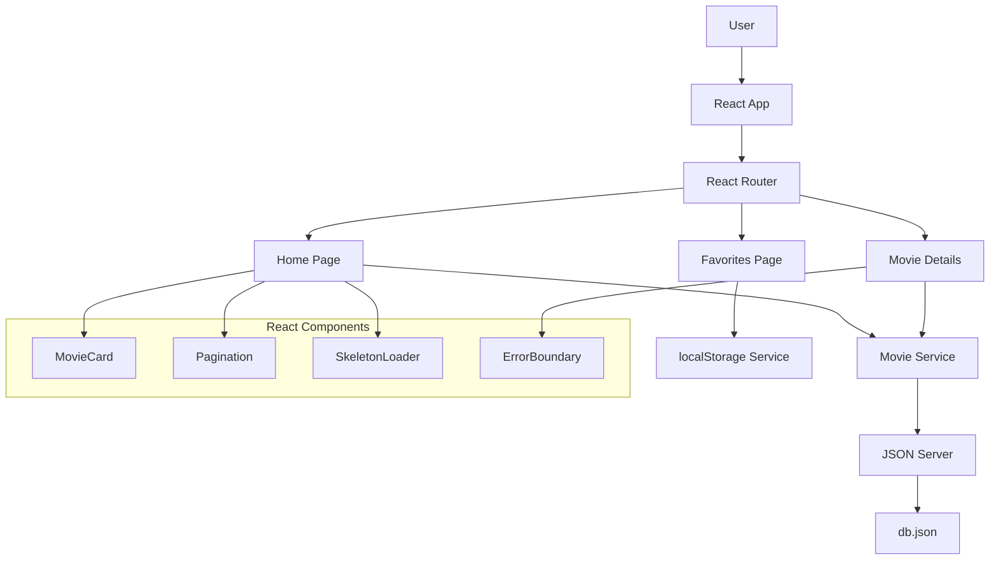
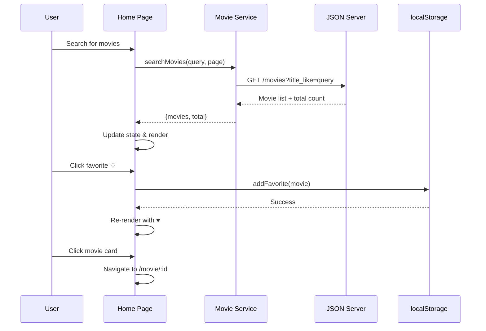

# Architecture Documentation

## High-Level Architecture

The React Movie Explorer follows a client-side single-page application (SPA) architecture with a mock JSON server for data.



## Component Architecture

### Page Components
- **Home**: Main search and listing page
- **MovieDetails**: Individual movie detail view
- **Favorites**: User's favorite movies list

### Shared Components
- **MovieCard**: Reusable movie display card
- **Pagination**: Page navigation controls
- **SkeletonLoader**: Loading state placeholder
- **ErrorBoundary**: Error handling wrapper

## Data Flow Sequence



## State Management Strategy

### Local Component State
- **Search Query**: Debounced search input
- **Loading States**: API request status
- **Pagination**: Current page and total pages
- **Error States**: Error messages and boundaries

### Persistent Storage
- **Favorites**: localStorage for user preferences
- **No Global State**: Simple app doesn't require Redux/Context

## API Layer Design

### Movie Service (`services/api.ts`)
```typescript
interface MovieService {
  searchMovies(query?: string, page?: number): Promise<{movies: Movie[], total: number}>
  getMovieById(id: number): Promise<Movie>
}
```

### Error Handling Strategy
1. **Network Errors**: Axios timeout and retry logic
2. **API Errors**: Graceful fallbacks with user messaging
3. **Runtime Errors**: Error boundaries for component crashes
4. **Image Errors**: Placeholder images for broken URLs

## Performance Considerations

### Optimization Techniques
- **Debounced Search**: 300ms delay to reduce API calls
- **Skeleton Loading**: Perceived performance during loading
- **Image Lazy Loading**: Browser-native loading strategy
- **Component Memoization**: useCallback for expensive operations

### Bundle Optimization
- **Code Splitting**: Could be added for larger apps
- **Tree Shaking**: Webpack eliminates unused code
- **Asset Optimization**: Images served via CDN URLs

## Accessibility Implementation

### ARIA Support
- `role` attributes for semantic meaning
- `aria-label` for screen reader context
- `aria-current` for pagination state
- `tabindex` management for keyboard navigation

### Keyboard Navigation
- Tab order through interactive elements
- Enter/Space activation for buttons
- Focus management on route changes
- Focus trapping in modal-like components

## Security Considerations

### Input Validation
- Search query sanitization
- URL parameter validation
- XSS prevention through React's built-in protection

### Data Handling
- No sensitive data stored in localStorage
- No authentication tokens (mock API)
- CORS properly configured for development

## Testing Strategy

### Unit Tests
- Utility functions (localStorage service)
- Component rendering and props
- Event handler behavior
- Error state handling

### Integration Tests
- API service calls and responses
- Component interaction with services
- Router navigation behavior
- localStorage persistence

### End-to-End Tests
- User workflows (search, favorite, navigate)
- Cross-browser compatibility
- Mobile responsiveness
- Accessibility compliance

## Deployment Architecture

### Development
```
localhost:3000 (React Dev Server)
localhost:3001 (JSON Server)
```

### Production Options

#### Vercel (Recommended)
- Static site hosting for React build
- Separate API deployment needed for JSON server
- Environment variable management
- Automatic deployments from Git

#### Netlify
- Static site with build optimization
- Form handling and serverless functions
- CDN distribution
- Branch preview deployments

## Scalability Considerations

### Current Limitations
- In-memory JSON server (not persistent)
- No user authentication
- Limited to 15 sample movies
- No caching strategy

### Future Enhancements
- Real database integration
- User authentication and profiles
- Server-side rendering (Next.js)
- Progressive Web App features
- Advanced search and filtering
- Movie recommendation engine

## Technology Decisions

### React 16.x with Hooks
- **Pros**: Modern patterns, better performance, smaller bundles
- **Cons**: Learning curve for class component developers
- **Alternative**: Class components with lifecycle methods

### Styled Components
- **Pros**: Component-scoped styles, dynamic theming, TypeScript support
- **Cons**: Runtime overhead, larger bundle size
- **Alternative**: CSS Modules or traditional CSS

### TypeScript
- **Pros**: Type safety, better IDE support, self-documenting code
- **Cons**: Build complexity, learning curve
- **Alternative**: JavaScript with PropTypes

### React Router v5
- **Pros**: Mature, stable, well-documented
- **Cons**: Larger than alternatives, not the latest version
- **Alternative**: Reach Router (now merged) or newer React Router v6

This architecture provides a solid foundation for a movie exploration app while maintaining simplicity and extensibility for future enhancements.